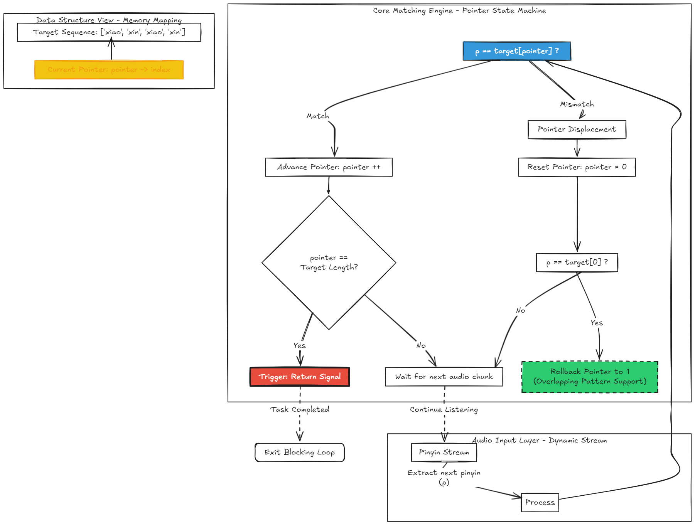

# AsrVosk SDK Documentation

[中文README](README_CN.md)

`AsrVosk` is a high-performance hotword (wake-word) detection component based on the Vosk ASR engine and a real-time Pinyin stream matching algorithm. It is engineered to provide low-latency, high-precision detection of specific phrases within continuous speech streams.

## Architectural Logic

The core of this component utilizes a **Pointer-based State Machine** matching algorithm rather than simple text comparison:

1. **Phonetic Decoupling**: Intermediate ASR results (Partial Results) are converted into Pinyin streams in real-time, effectively shielding the system from recognition interference caused by homophones.
2. **Concurrent State Pointers**: An independent `HotwordSequence` pointer is maintained for every pre-defined hotword.
3. **Streaming Sequence Matching**:
    * **Forward Progression**: The pointer advances unidirectionally as the Pinyin sequence from the speech stream matches the target hotword syllables one by one.
    * **Intelligent Rollback**: If a mismatch occurs and the current character is not the starting syllable of the hotword, the pointer resets to 0; however, if the mismatched character happens to be the starting syllable, the pointer rolls back to 1.
    * **Advantages**: This design supports partially overlapping hotword patterns, significantly reducing the miss rate.


4. **Resource Scheduling**: The system employs a single-threaded blocking listener, utilizing a signal mechanism to interrupt and return immediately upon a successful match.



## 1. Environment & Dependencies

* **Python**: 3.8+
* **Vosk API**: `pip install vosk`
* **PyAudio**: `pip install pyaudio`
* **Pypinyin**: `pip install pypinyin`

> **Model Requirement**: A valid Vosk Chinese model (e.g., `vosk-model-small-cn-0.22`) must be downloaded and extracted locally.

## 2. Integration Guide

### Initial Configuration

```python
from asr_vosk import AsrVosk

# Define Hotword Mapping (Hotword : Trigger Signal)
hotwords_config = {
    "小新小新": 1,
    "系统重启": "REBOOT_SIGNAL",
    "确认执行": True
}

# Initialize the detector
asr = AsrVosk(
    model_path="path/to/vosk_model",
    hotwords=hotwords_config
)

```

### Execution

The `listen_for_hotword()` method enters a blocking loop until a specified hotword is captured:

```python
signal = asr.listen_for_hotword()
print(f"Detected Signal: {signal}")

```

## 3. Technical Specifications

* **ASR Engine**: Vosk (Kaldi-based architecture).
* **Audio Specs**: 16000 Hz, Mono channel.
* **Matching Granularity**: Pinyin-level phonetic matching.
* **Buffer Management**: Automatically flushes invalid Pinyin streams exceeding 15 characters to prevent memory accumulation.
* **Concurrency**: Supports simultaneous monitoring of 10+ hotwords with minimal computational overhead.

## 4. Output Logic

During the matching process, the system provides real-time logs of partial results and their corresponding Pinyin streams for debugging purposes:

```text
Partial: 小新  Pinyin Stream: ['xiao', 'xin']
Partial: 小新小新  Pinyin Stream: ['xiao', 'xin', 'xiao', 'xin']
>> Match Found: Signal 1

```

