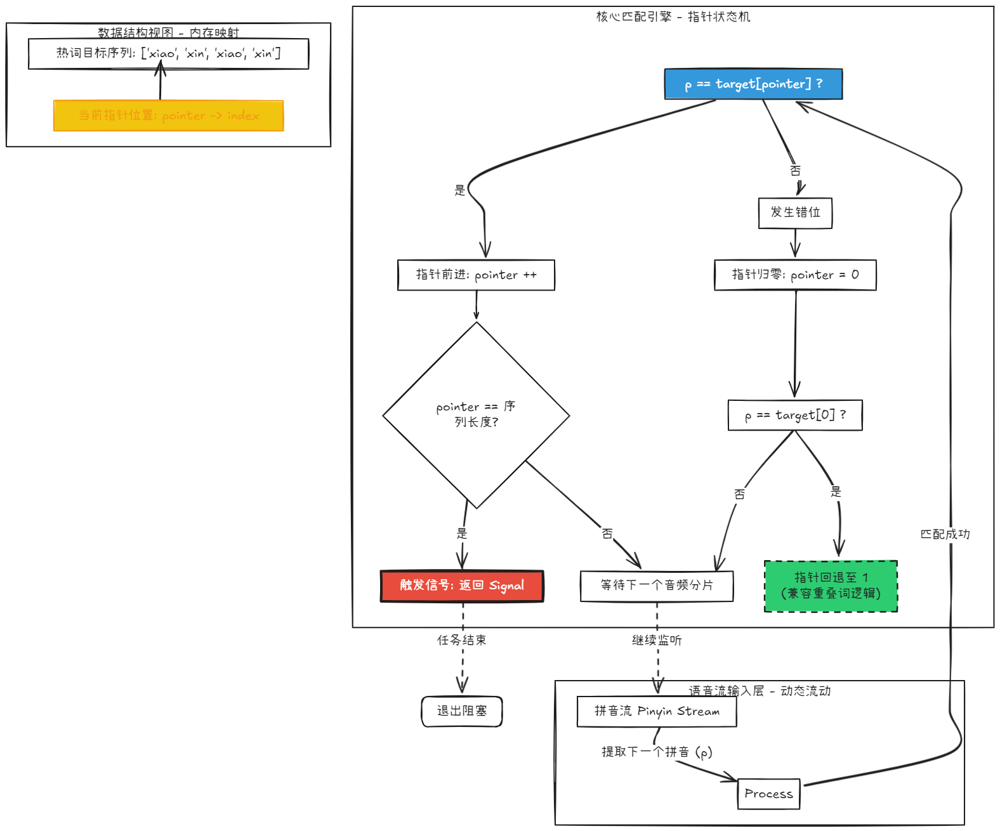

# AsrVosk SDK Documentation

`AsrVosk` 是一个基于 Vosk ASR 引擎与拼音流匹配算法的高性能热词（唤醒词）检测组件。它旨在解决连续语音流中特定短语的低延迟、高精度识别问题。

## 核心设计逻辑 (Architectural Logic)

本组件的核心并非简单的文本匹配，而是基于**状态机指针**的拼音流匹配算法：

1. **拼音解耦**：将 ASR 输出的中间识别结果（Partial Result）实时转换为拼音流，屏蔽同音字带来的识别干扰。
2. **多并发状态指针**：为每个预设热词维护一个独立的 `HotwordSequence` 指针。
3. **流式序列匹配**：
    * 当语音流产生的拼音序列与热词拼音逐个匹配时，指针单向推进。
    * 若匹配中断且当前字符非热词首字，指针重置为 0；若中断字符恰好是热词首字，则指针回退至 1。
    * **优点**：支持热词部分重叠匹配，极大地降低了漏检率。
4. **资源调度**：采用单线程阻塞式监听，匹配成功后立即通过信号（Signal）机制中断并返回。



## 1. 环境依赖 (Environment)

* **Python**: 3.8+
* **Vosk API**: `pip install vosk`
* **PyAudio**: `pip install pyaudio`
* **Pypinyin**: `pip install pypinyin`

> **模型要求**：需下载 Vosk 官方中文模型（如 `vosk-model-small-cn-0.22`）并解压至本地。

## 2. 快速集成 (Integration)

### 初始化配置

```python
from asr_vosk import AsrVosk

# 定义热词映射表（热词名称 : 触发信号）
hotwords_config = {
    "小新小新": 1,
    "系统重启": "REBOOT_SIGNAL",
    "确认执行": True
}

# 实例化检测器
asr = AsrVosk(
    model_path="path/to/vosk_model",
    hotwords=hotwords_config
)

```

### 启动监听

`listen_for_hotword()` 方法将进入阻塞模式，直到捕获到指定热词：

```python
signal = asr.listen_for_hotword()
print(f"Detected Signal: {signal}")

```

## 3. 技术参数说明 (Technical Specifications)

* **ASR 引擎**: Vosk (Kaldi-based)
* **采样率**: 16000 Hz (Mono)
* **匹配颗粒度**: 拼音级 (Pinyin-level)
* **容错机制**: 自动清理超过 15 个字符的无效拼音流缓冲，防止内存积压。
* **并发性能**: 支持 10+ 个热词同时监听，匹配损耗极低。

## 4. 输出说明 (Output)

系统在匹配过程中会实时打印中间识别结果及其对应的拼音流，便于开发者调试匹配阈值：

```text
中间结果：小新  拼音流：['xiao', 'xin']
中间结果：小新小新  拼音流：['xiao', 'xin', 'xiao', 'xin']
>> Match Found: 信号 1

```
